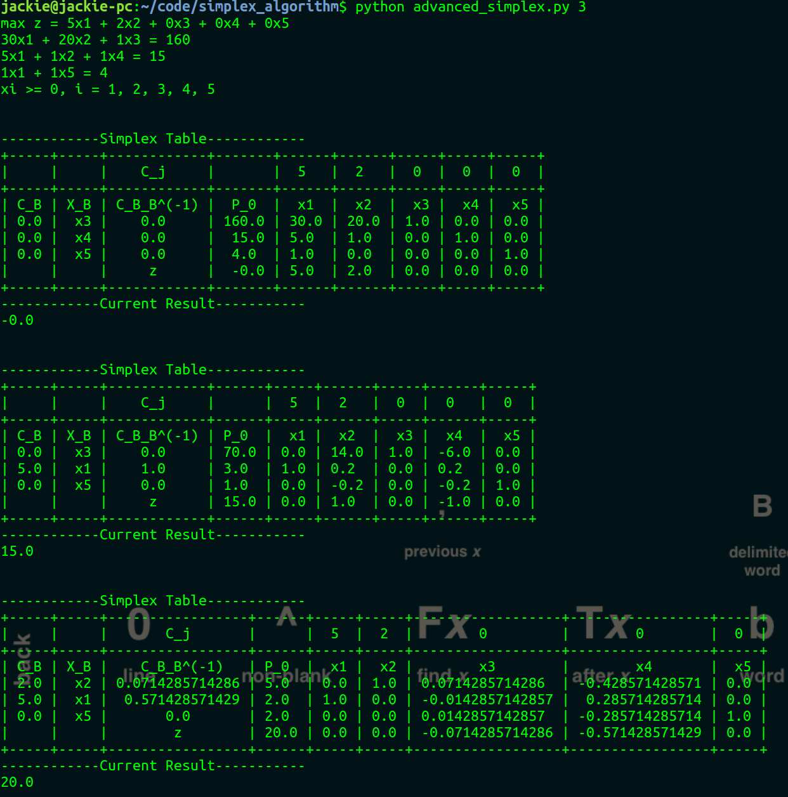

# Simplex Algorithm Implementation with Simplex Tables

# Installiation
```
pip install PTable
```
or
```
easy_install PTable
```

# Run
```
python advanced_simplex.py [number]
```
P.s. number can be [1, 2, 3] for three different test cases

# Result Screenshot



